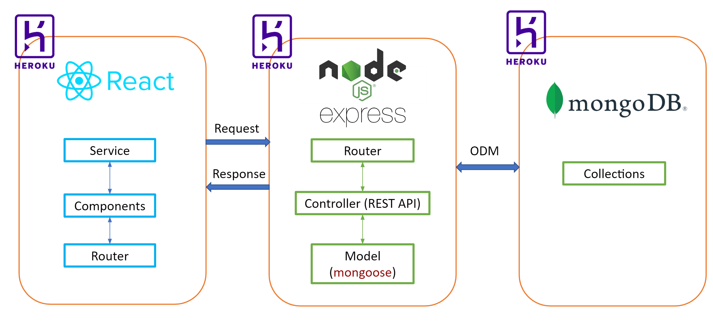
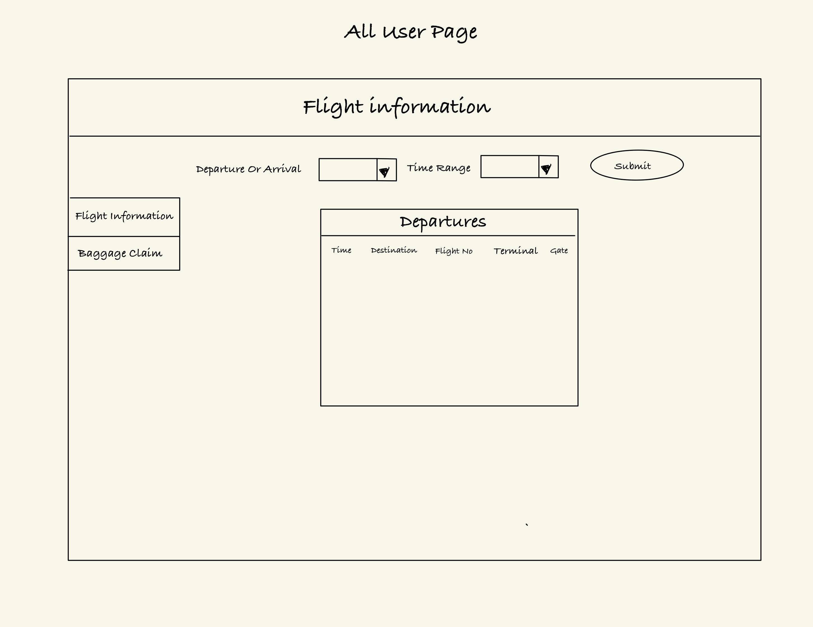
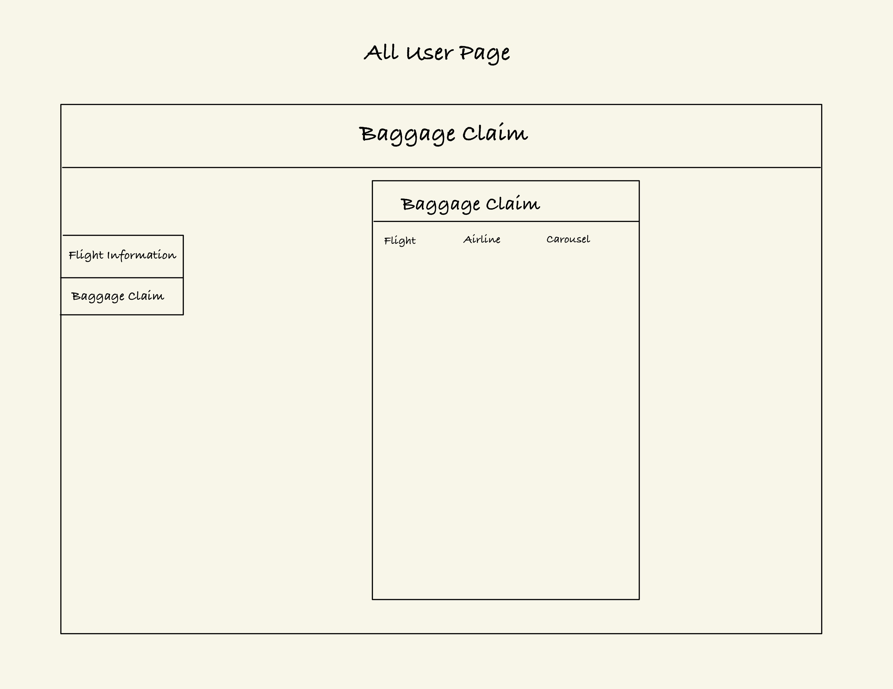
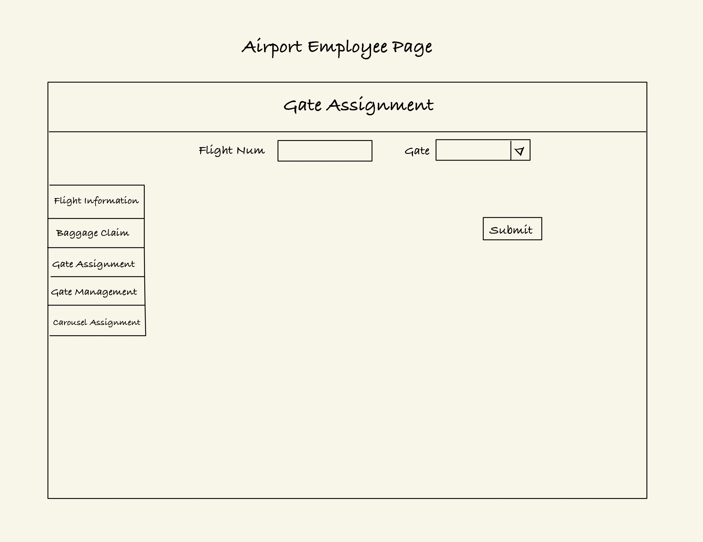
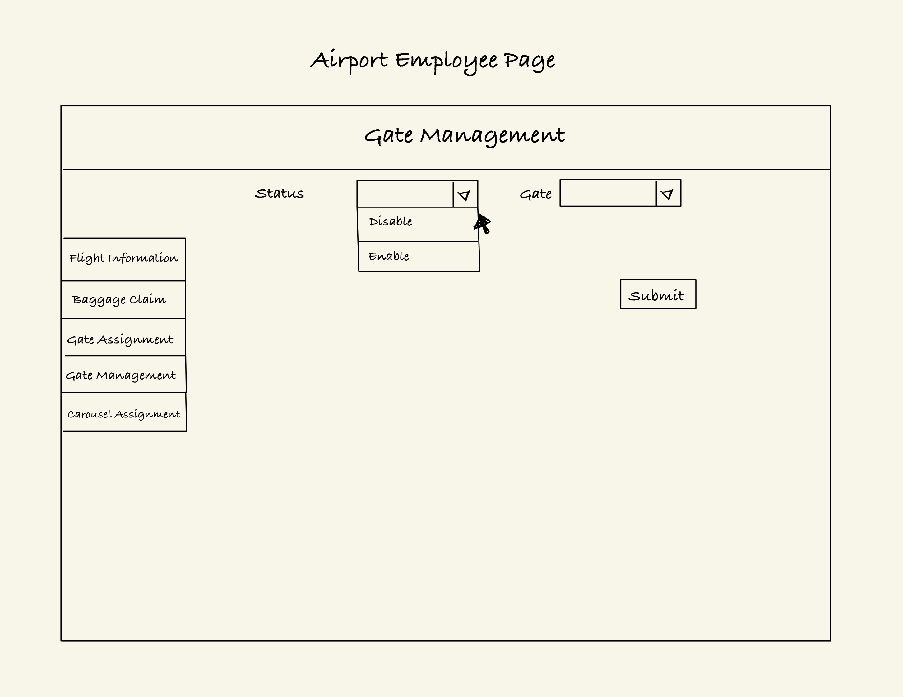
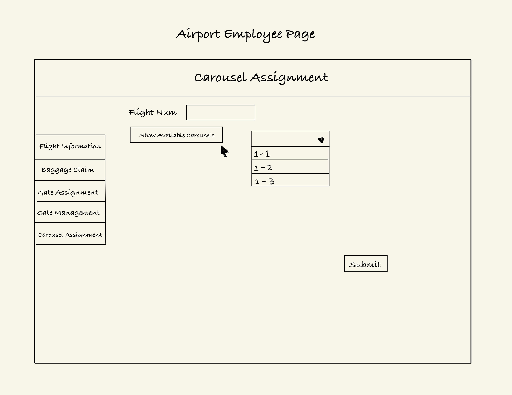
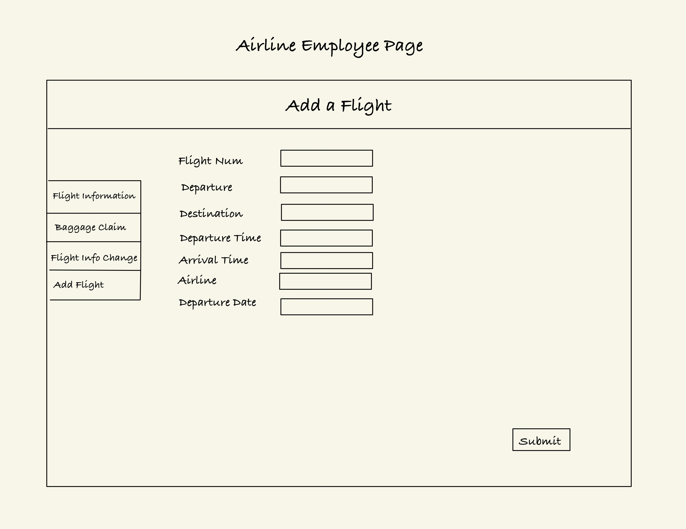
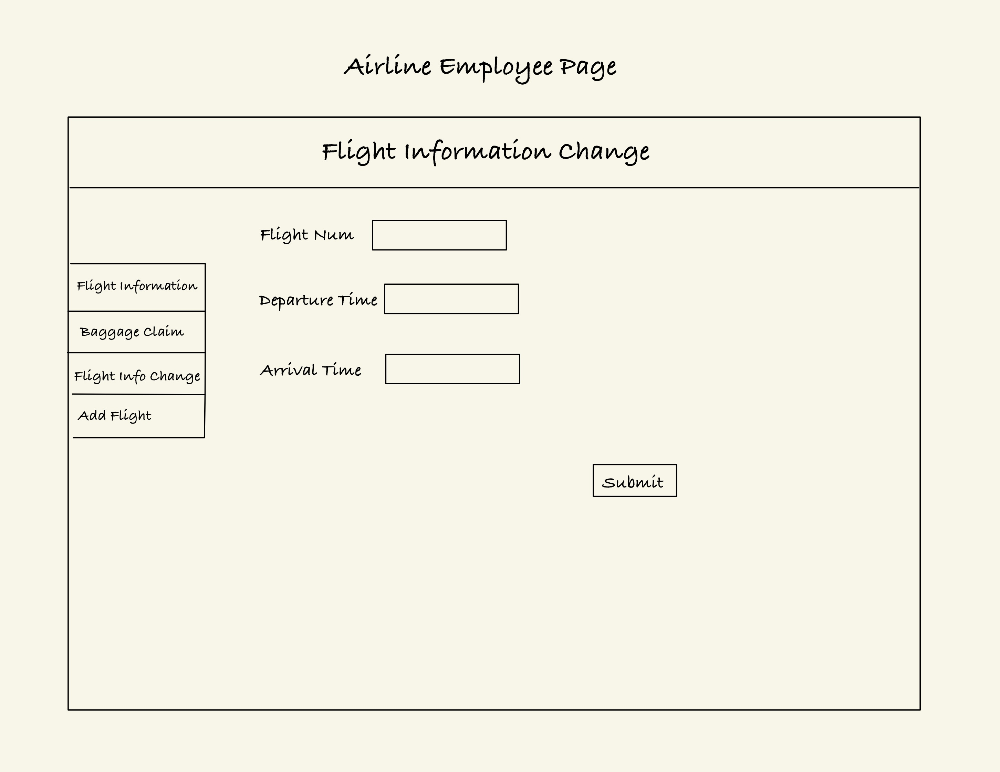

# team-project-minions
### Sprint Planning nad backlog items Link:
https://docs.google.com/spreadsheets/d/1lZoEsoroYPZCjyOl1dUuCdAVNN_gpRtL5qCBEIrvbNQ/edit#gid=0
### Two XP Core Values we Chose:
- Communication:
Have schedule two meetings per week to let everyone update their status. Discuss on common issues. And have a group chat so we can keep communicating daily.
- Courage:
objectively evaluate our own results without making excuses and are always ready to respond to changes.

# Temp Line
## react install:
```
npm install -g create-react-app
```
## react create:
```
create-react-app projectname
```
## react router dom:
```
npm install react-router-dom
```
## install material UI:
```
npm install @mui/material @emotion/react @emotion/styled
```

# Design Document
## Team Members:
- Xialu Zou xialu.zou@sjsu.edu
- Jie Liu jie.liu01@sjsu.edu
- Lingxiang Hu lingxiang.hu@sjsu.edu
## Project Name
**Airport Management system**
## Project Requirements
- Store Flight information,arrivals and departures and Gate assignments, and show in UI. (can be seen by all user)
- Implement gate assignment for arrival and departure flights, accessed by Airport employees.Gates are distributed in multiple terminals(1,2,3) and labeled as A1-A32, B1-B32 and C1-C32
- Implement Baggage Carousel number assignment to Arriving flights,  accessed by Airport employees.
- Show Baggale Claim information in another chart (can be seen by all user)
- Airline employee can add or update the schedule of flights belonging to their airline
- Different pages for airport employee, airline employee and all users. 

## System Architectur Design

## UI Wireframe
### All User Accessing Page


### Airport employee Accessing Page



### Airline employee Accessing Page


## DataBase Schema and API design 
https://docs.google.com/document/d/1S7zite5Kjig0bj6BegRCOSNRUrfUB6KZM6k8tfNYiz0/edit?pli=1
## Design Problems and Choices
### How to make sure the gate and carousel for one flight is in the same terminal
We decided to use two seprated pages to to the assignment. In consideration that we need the current carousel information after the flight land. And to make sure the gate and carousel is in the same terminal, we decided to add an API, that will check the terminal of the chosen flight, get all available carousel for that flight, and list it for choices.
### How to keep track of the available/occupied status of a carousel or a gate 
We will record a lastUseTime for a gate and a carousel. When we check the availability for all gates or carousel, if this time has passed. We will think this gate or carousel to be available.


